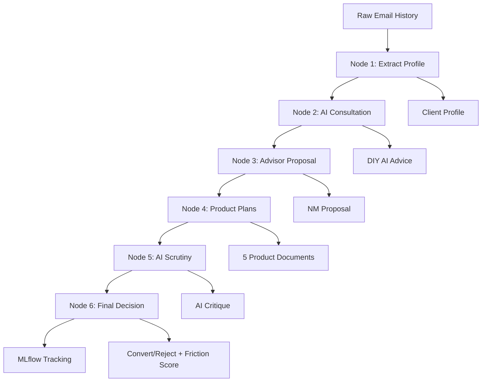

# Project CAII - Multi-Agent Simulation Framework

**Northwestern Mutual AI-Proof Sales Strategy Simulator**

A Python-based multi-agent simulation framework using LangGraph to simulate the competitive cycle between Northwestern Mutual advisors and public AI consultations, helping develop "AI-proof" sales strategies.

## 🎯 Business Problem

Northwestern Mutual Advisors are losing deals because clients "pre-consult" public AI (like Gemini, GPT, Claude) which suggests low-cost DIY strategies. This framework simulates that competitive cycle to help develop strategies that withstand AI-driven client pre-consultation.

## 🏗️ Architecture



## 📋 Workflow Nodes

1. **Extraction Node**: Analyzes 50 unstructured emails to extract:
   - Financial standing (assets, income, liabilities)
   - Psychology (skepticism 1-10, communication style)
   - Legacy needs (insurance, family, estate goals)

2. **Initial AI Consultation Node**: Client "Digital Twin" consults public AI for DIY advice

3. **Advisor Proposal Node**: Simulated NM Advisor generates comprehensive proposal

4. **Product Plan Generation Node**: Creates individual documents for:
   - Term Life Insurance (10/20/30 year)
   - Whole Life Insurance
   - Disability Insurance (DI)
   - Annuity Strategy
   - Cash Buffer (SGOV)

5. **AI Scrutiny Node**: Public AI critiques each product:
   - Bad/Good/Very Good Product ratings
   - Suitable/Not Suitable assessments
   - Alternative suggestions

6. **Final Outcome Node**: Client decides Convert vs. Reject with friction score (0-100)

## 🚀 Quick Start

### Installation

```bash
# Clone or navigate to the project directory
cd FRclientbattle

# Install dependencies
pip install -r requirements.txt
```

### Configuration

Set your API key for the LLM provider:

```bash
# For Google Gemini (recommended)
export GOOGLE_API_KEY="your-api-key-here"

# Or for Anthropic Claude
export ANTHROPIC_API_KEY="your-api-key-here"

# Or for OpenAI GPT
export OPENAI_API_KEY="your-api-key-here"
```

For Databricks serving endpoints (optional):

```bash
export DATABRICKS_SERVING_ENDPOINT="https://your-workspace.cloud.databricks.com/serving-endpoints"
export DATABRICKS_TOKEN="your-databricks-token"
```

### Run with Streamlit UI

```bash
streamlit run streamlit_app.py
```

Then open your browser to `http://localhost:8501`

### Run Programmatically

```python
from project_caii_framework import run_simulation

# Your email history
email_history = """
Email 1: ...
Email 2: ...
...
Email 50: ...
"""

# Run simulation
result = run_simulation(email_history, model="gemini")

# Access results
print(f"Decision: {result['metadata']['converted']}")
print(f"Friction Score: {result['friction_score']}")
print(f"Outcome: {result['outcome']}")
```

### Test with Sample Data

```bash
python project_caii_framework.py --test
```

## 📊 Streamlit UI Features

The Streamlit interface provides:

- **Input & Run Tab**: 
  - Email history input (with sample data)
  - Real-time simulation execution
  - Progress tracking

- **Results Dashboard Tab**:
  - Key metrics (decision, friction score, products)
  - Expandable sections for each workflow node
  - Download buttons for all outputs

- **Documents Tab**:
  - View all generated documents
  - Individual document downloads
  - Bulk JSON export

- **Analysis Tab**:
  - Friction score interpretation
  - Decision breakdown
  - Execution timeline
  - Strategic insights and recommendations

## 🧱 Databricks Deployment

### Option 1: Databricks Apps (Recommended)

```bash
# From Databricks workspace
databricks apps create project-caii --source-dir .
```

### Option 2: Databricks Notebook

1. Upload `project_caii_framework.py` to Databricks workspace
2. Create a new notebook
3. Import and run:

```python
%run ./project_caii_framework

# Run simulation
result = run_simulation(your_email_history, model="gemini")
```

### Option 3: Databricks Job

Create a job that runs `project_caii_framework.py` on a schedule for batch processing.

## 📈 MLflow Integration

The framework automatically logs to MLflow:

**Parameters:**
- Model used
- Simulation date
- Decision (Convert/Reject)

**Metrics:**
- Friction score (0-100)

**Artifacts:**
- Client profile
- Initial AI advice
- Advisor proposal
- All product plans (5 documents)
- AI critique
- Final outcome

**Tags:**
- Framework: LangGraph
- Business unit: Northwestern Mutual
- Simulation type: AI_Competition

View results in MLflow UI:

```bash
mlflow ui
```

Or in Databricks: Navigate to **Experiments** → **Project_CAII**

## 🔧 Configuration Options

### Model Selection

The framework supports three LLM providers:

```python
# Google Gemini (preferred)
result = run_simulation(emails, model="gemini")

# Anthropic Claude
result = run_simulation(emails, model="claude")

# OpenAI GPT
result = run_simulation(emails, model="gpt")
```

### Custom Databricks Endpoints

```python
import os
os.environ["DATABRICKS_SERVING_ENDPOINT"] = "your-endpoint"
os.environ["DATABRICKS_TOKEN"] = "your-token"

result = run_simulation(emails, model="gemini")
```

## 📁 Project Structure

```
FRclientbattle/
├── project_caii_framework.py   # Core LangGraph framework
├── streamlit_app.py             # Streamlit UI
├── requirements.txt             # Python dependencies
├── README.md                    # This file
└── .env                         # API keys (create this)
```

## 🎓 Key Concepts

### Zero-Bias Design

All client data is derived from the input email history. No hardcoded values ensure realistic, varied simulations.

### Friction Score

Quantifies the conflict between AI advice and NM proposal (0-100):
- **0-20**: High alignment, easy decision
- **21-40**: Some tension, clear winner
- **41-60**: Moderate conflict, difficult choice
- **61-80**: High conflict, very close decision
- **81-100**: Extreme conflict, almost a coin flip

### Enterprise Scaling

The Advisor agent represents a "Standardized NM Professional" approach, not a specific individual, ensuring consistent, scalable simulations.

## 🔍 Use Cases

1. **Strategy Development**: Test different advisor approaches against AI objections
2. **Training**: Show advisors common AI-generated objections and effective responses
3. **Product Optimization**: Identify which products are most vulnerable to AI critique
4. **Client Segmentation**: Understand which client profiles are most/least susceptible to AI influence
5. **Competitive Intelligence**: Track how AI recommendations evolve over time

## 🛠️ Troubleshooting

### "Module not found" errors

```bash
pip install -r requirements.txt --upgrade
```

### API key errors

Ensure your API key is set:

```bash
echo $GOOGLE_API_KEY  # Should print your key
```

### Streamlit not loading

```bash
# Clear cache
streamlit cache clear

# Run with verbose logging
streamlit run streamlit_app.py --logger.level=debug
```

### MLflow tracking issues

```bash
# Set tracking URI explicitly
export MLFLOW_TRACKING_URI="databricks"
```

## 📝 Sample Email History Format

The framework expects 50 unstructured email interactions that reveal:

- Financial situation (income, assets, debts)
- Family structure (spouse, children, dependents)
- Insurance needs and concerns
- Skepticism level and decision-making style
- Prior research or AI consultations

See `SAMPLE_EMAIL_HISTORY` in `project_caii_framework.py` for a complete example.

## 🤝 Contributing

This is an internal Northwestern Mutual tool. For questions or improvements, contact the AI Architecture team.

## 📄 License

Proprietary - Northwestern Mutual Internal Use Only

## 🙏 Acknowledgments

- **Framework**: LangGraph by LangChain
- **LLM**: Google Gemini (preferred)
- **Tracking**: MLflow
- **UI**: Streamlit

---

**Project CAII** - *Competitive AI Intelligence*  
Northwestern Mutual | AI Architecture Team | 2026
